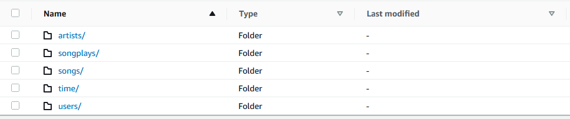

# Data Lake with AWS and Apache Spark.
Hello there. This is a project to help analytics team to get insight from their users in what songs are played. As Data Engineer I'll develop a ETL process to get the data through S3 bucket and process the data with apache spark to create the table that they need to analyze the data.
The ETL consume S3 Bucket and the load the data into a Spark Dataframe creating the correspond tables as well as loading to the data into the S3 Data Lake as parquet file.

### Technical Information:
* ETL: Apache Apache Spark (PySpark).
* Data Lake: AWS S3.

### How to execute the Process:
* First of all, make sure that you have installed python with this command: ```python -V```.
* Then execute the 'etl.py' to consume the data, process it and load it into the Data Lake with this command: ```python elt.py```.

### Files:
* etl.py: PySpark etl process.
* dl.cfg: config file with AWS Credentials.
* test.ipynb: Jupyter Notebook file to test functions and ETL Process.

Enjoy looking at the output while Spark execute.

### Output in the Data Lake
